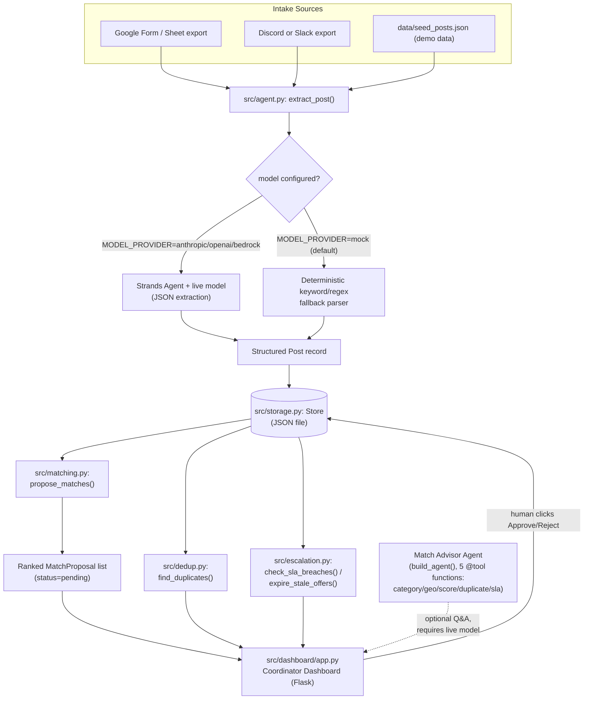

# Neighbor Dispatch

Agent-assisted matching for mutual-aid coordinators — built for the Agents for
Humans hackathon, Good Neighbor Agents track.

## What this is and why it matters

After a disaster, the hardest logistics problem isn't a lack of generosity — it's
matching it. In the January 2025 LA wildfires, volunteer networks like MALAN
(Mutual Aid LA Network) ran their entire need/offer matching operation on a
hand-updated spreadsheet plus a sprawl of Signal groups: a single overworked
coordinator (or a rotating handful of them) manually reading incoming posts,
guessing at duplicates, and pinging around Signal to see if an offer was still
good, while urgent needs sat unanswered because no one had eyes on the whole
board at once. That stack does not scale past a few dozen posts a day, and it
puts the entire matching quality on one exhausted human's short-term memory.
Neighbor Dispatch is built for that exact coordinator: it turns free-text
need/offer posts into structured records, proposes ranked matches with a
deterministic scoring engine, flags likely duplicate posts automatically, and
escalates urgent needs that have gone unanswered too long — while keeping a
human coordinator as the only one who can ever finalize a match, via an explicit
Approve/Reject click on a dashboard. It replaces the spreadsheet-and-Signal-group
stack, not the human judgment sitting on top of it.

## Architecture



See [`docs/architecture.md`](docs/architecture.md) for the module-by-module
breakdown and a note on why the human-approval gate is enforced in code, not
just in the UI. A standalone image rendering of the diagram above is also at
[`docs/architecture.svg`](docs/architecture.svg) / [`docs/architecture.png`](docs/architecture.png).

## Quick start

```bash
python -m venv venv && source venv/bin/activate
pip install -r requirements.txt
cp .env.example .env
```

Leaving `MODEL_PROVIDER=mock` in `.env` (the default) needs no API key at all —
`src/agent.py` falls back to a deterministic keyword/regex extractor, so the
whole pipeline runs fully offline.

Run the demo pipeline against the seed data:

```bash
python demo.py
```

Then bring up the coordinator dashboard:

```bash
python demo.py --serve
```

and open **http://localhost:5050** to see posts, ranked match proposals,
duplicate flags, and SLA escalations, with Approve/Reject buttons on each
proposed match.

To try the optional Match Advisor agent in live, tool-calling mode:

```bash
python demo.py --ask "Why hasn't the need from Maria been matched yet?"
```

This mode requires a real model key configured in `.env`
(`MODEL_PROVIDER=anthropic`, `openai`, or `bedrock` — see below) — it will not
work with `MODEL_PROVIDER=mock` since there is no live reasoning loop to run
without a model.

### Seeing the agent's tool-calling loop without waiting on cloud credentials

The judgment-and-tool-calling part of this system (the Match Advisor) is real
Strands agent behavior, and it's not something you should have to take on
faith or wait on an API key to see. Two ways to see it, from cheapest/no-setup
to fully live:

1. **No API key, no network, right now:**
   ```bash
   python demo.py --worked-example
   ```
   This drives the *real* `build_agent()` Strands `Agent` and its *real* five
   `@tool` functions through a concrete judgment question ("why hasn't the need
   from Maria been matched yet?"), printing each tool call and its real result
   live as the agent's event loop executes them, then the agent's final
   synthesized answer. The only thing scripted is which tool gets called next
   and the final wording — every number in the transcript comes from actually
   calling `category_matches()`, `zone_distance_miles()`, `score_match()`,
   `is_duplicate()`, and `check_sla_breaches()` against the real seeded data.
   See [`examples/match_advisor_worked_example.py`](examples/match_advisor_worked_example.py)
   for exactly what's real vs. scripted, and
   [`src/scripted_model.py`](src/scripted_model.py) for how it plugs a
   deterministic offline stand-in into Strands' real `Model` interface.
2. **A real model choosing its own tool calls, cheaply:** set
   `MODEL_PROVIDER=bedrock` in `.env` (default model
   `us.amazon.nova-pro-v1:0`, a low-cost Bedrock model — no other provider
   extras to install, since `strands-agents` already depends on `boto3`) with
   AWS credentials configured in your environment (`aws configure`, or
   `AWS_ACCESS_KEY_ID`/`AWS_SECRET_ACCESS_KEY`/`AWS_SESSION_TOKEN`), then run
   `python demo.py --ask "Why hasn't the need from Maria been matched yet?"`.
   This is the real thing: the model decides its own tool call sequence and
   writes its own answer. `anthropic`/`openai` work the same way with their
   own API keys.

## Running tests

```bash
pytest tests/ -v
```

The entire test suite is offline and mocked — no API key and no network access
are required to run it. Every provider call is stubbed or bypassed via the
deterministic fallback path, so `pytest tests/ -v` passes the same way in CI as
it does on a laptop with no `.env` file at all. This includes
`tests/test_worked_example.py` (proves the offline worked example really drives
five real tool calls) and `tests/test_agentcore_app.py` (skips itself cleanly if
the optional `bedrock-agentcore` dependency isn't installed; see below).

## Project structure

```
neighbor-dispatch/
  demo.py                    # CLI entry point: run pipeline, --serve dashboard, --ask advisor, --worked-example
  data/seed_posts.json       # Synthetic demo posts (needs and offers) to seed a run
  src/models.py              # Post, MatchProposal, and enum type definitions
  src/matching.py            # Deterministic propose_matches() scoring engine
  src/dedup.py                # find_duplicates() repeat-post detector
  src/escalation.py          # check_sla_breaches() / expire_stale_offers()
  src/config.py               # build_model(): reads MODEL_PROVIDER and builds a Strands model
  src/agent.py                # extract_post() + build_agent() (Match Advisor)
  src/scripted_model.py       # ScriptedAdvisorModel: offline Strands Model stand-in for the worked example
  src/storage.py              # Store: JSON-file-backed repository, home of approve_match()
  src/tools/category_tool.py  # @tool wrapper: category classification
  src/tools/geo_tool.py       # @tool wrapper: geographic proximity
  src/tools/score_tool.py     # @tool wrapper: match scoring
  src/tools/duplicate_tool.py # @tool wrapper: duplicate detection
  src/tools/sla_tool.py       # @tool wrapper: SLA breach checking
  src/dashboard/app.py         # Flask coordinator dashboard (Approve/Reject UI)
  examples/match_advisor_worked_example.py  # offline worked example (see above)
  deploy/agentcore_app.py     # Bedrock AgentCore Runtime wrapper (see below)
  tests/                      # pytest suite, fully offline/mocked
  docs/architecture.md        # module-by-module breakdown
  docs/architecture.svg, .png # standalone architecture diagram image files
  README.md
  LICENSE
  requirements.txt
  requirements-agentcore.txt  # optional extra, only for deploy/agentcore_app.py
  .env.example
  .gitignore
```

## Swapping model providers

Model selection is entirely driven by the `MODEL_PROVIDER` variable in `.env`
(see [`.env.example`](.env.example) for the full annotated template):

- **`mock`** (default) — no key needed. `src/agent.py` uses a deterministic
  keyword/regex parser instead of calling a model. This is the mode the demo,
  the dashboard, and the whole test suite are designed to run in.
- **`anthropic`** — set `ANTHROPIC_API_KEY` (and optionally `ANTHROPIC_MODEL_ID`,
  default `claude-sonnet-4-6`) in `.env`. Requires the `strands-agents[anthropic]`
  extra.
- **`openai`** — set `OPENAI_API_KEY` (and optionally `OPENAI_MODEL_ID`, default
  `gpt-4o`) in `.env`. Requires the `strands-agents[openai]` extra.
- **`bedrock`** — set `BEDROCK_MODEL_ID` (default
  `us.amazon.nova-pro-v1:0`); this provider uses your local AWS
  credentials/region rather than an API key in `.env`.

`MODEL_TEMPERATURE` and `MODEL_MAX_TOKENS` in `.env` apply to whichever live
provider is selected.

## Optional: Bedrock AgentCore deployment

This is an optional strengthening step, **not required** to run the demo — the
project runs entirely locally with `python demo.py`. [`deploy/agentcore_app.py`](deploy/agentcore_app.py)
wraps `ask_match_advisor()` / `build_agent()` from `src/agent.py` — the exact
same Match Advisor agent and five real tools `demo.py --ask` uses, with no
changes to the tool logic itself — as a Bedrock AgentCore Runtime HTTP service
(`/invocations`, `/ping`), using the `bedrock-agentcore` SDK's `BedrockAgentCoreApp`.

**Status:** implemented, and verified locally/offline —
[`tests/test_agentcore_app.py`](tests/test_agentcore_app.py) drives it through
Starlette's `TestClient` with zero network access (it's part of `pytest tests/ -v`,
and skips itself cleanly if the optional dependency below isn't installed). It has
**not** been deployed to a live AWS-hosted endpoint from the environment this
project was built in: doing that requires `agentcore configure` / `agentcore
launch` (from `bedrock-agentcore-starter-toolkit`) run with real AWS credentials
and network access to Bedrock AgentCore's control-plane APIs, which that
development sandbox's egress policy does not allow (outbound AWS API calls
returned a 403 from its network proxy). Anyone with AWS access can deploy it for
real with no code changes:

```bash
pip install -r requirements.txt -r requirements-agentcore.txt
agentcore configure --entrypoint deploy/agentcore_app.py
agentcore launch
```

Similarly, the `check_sla_breaches()` / `expire_stale_offers()` sweep in
`src/escalation.py` is a pure function over the store's current state, so it
could be scheduled as a recurring AgentCore job (rather than run on-demand from
`demo.py`) to page a coordinator the moment an urgent need breaches its SLA
window, instead of only on the next manual run — that scheduling piece is
still just described here, not implemented.

## Submission checklist status

Everything above is code in this repo, verified by running it. A few hackathon
submission requirements live outside the codebase and need a maintainer with
the right accounts/credentials to complete them (not achievable from the
sandboxed environment this repo was assembled in, which has no GitHub write
access to create a new repo and no AWS network egress):

- [ ] **Public GitHub repo with this code pushed, MIT LICENSE visible in the
      About section.** This repo is git-initialized locally (see `.gitignore`)
      and ready to push — `git remote add origin <your-repo-url> && git push -u
      origin main`.
- [ ] **Demo video (≤5 min, YouTube/Vimeo, public)** showing `python demo.py`
      running end-to-end, the dashboard with live Approve/Reject clicks, and
      narrating the problem (MALAN's spreadsheet/Signal/Discord breakdown in
      the Jan 2025 LA fires), who it's for (volunteer mutual-aid coordinators),
      and why it matters (matching/dedup/escalation is the bottleneck, not data
      entry).
- [ ] **AWS Builder ID** for the submission form.
- [ ] *(Optional)* Live hosted demo link (`python demo.py --serve` deployed
      somewhere reachable, or the AgentCore endpoint above once actually
      launched).
- [ ] *(Optional)* Real mutual-aid volunteer/coordinator feedback on whether
      the scoring/dedup/SLA thresholds in `src/matching.py` / `src/dedup.py` /
      `src/escalation.py` match real-world triage — everything is currently
      validated only against the synthetic seed data in `data/seed_posts.json`.

## Disclosures

This project was newly built for the Agents for Humans hackathon
(Aug 10 - Sep 14 2026) using the `strands-agents` SDK, Flask, and standard
Python libraries. The demo data in `data/seed_posts.json` is synthetic and
modeled loosely on MALAN's public reporting about the January 2025 LA wildfire
response — it does not contain real individuals' data, names, or locations.

## License

MIT — see [LICENSE](LICENSE).
