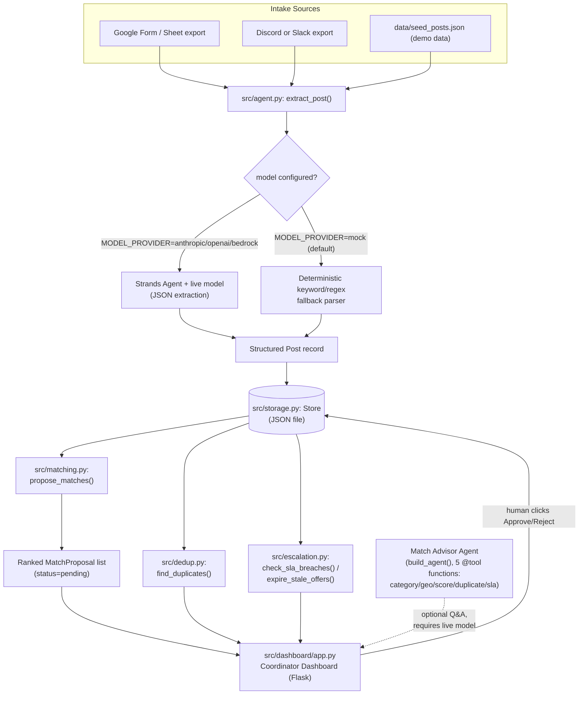

# Architecture

Neighbor Dispatch turns free-text mutual-aid posts (needs and offers) into structured
records, proposes ranked matches between them, flags likely duplicate posts, escalates
needs that have breached their SLA, and requires a human coordinator to click
Approve/Reject before any match is considered final. The diagram below is the real
module layout, not an aspirational one.

A standalone rendering of the same diagram (not just inline Mermaid) is available as an
image file at [`architecture.svg`](architecture.svg) / [`architecture.png`](architecture.png),
generated from the exact Mermaid source above.

## Module responsibilities

- **`src/agent.py` (`extract_post()`)** — takes a raw free-text post and returns a
  structured `Post` record (category, urgency, location, need-vs-offer, description).
  When `MODEL_PROVIDER` names a real provider, this calls a Strands `Agent` bound to a
  live model and asks it to return JSON. When `MODEL_PROVIDER=mock` (the default), it
  falls back to a deterministic keyword/regex parser — same output shape, no network
  call, no API key, fully reproducible for tests and offline demoing.
- **`src/storage.py` (`Store`)** — a small JSON-file-backed repository holding the
  list of `Post` records and `MatchProposal` records. Every other module reads from and
  writes to this one store, so it is the single source of truth the dashboard renders
  from and the only place state is persisted between runs.
- **`src/matching.py` (`propose_matches()`)** — deterministic scoring engine that pairs
  open needs with open offers (by category, geography, urgency, recency) and produces
  a ranked list of `MatchProposal` objects. Every proposal is created with
  `status="pending"` — nothing here can mark a match approved.
- **`src/dedup.py` (`find_duplicates()`)** — flags posts that look like repeats of an
  existing post (same requester, near-identical text, same category/location within a
  short time window), so a coordinator doesn't double-dispatch help for one need.
- **`src/escalation.py` (`check_sla_breaches()` / `expire_stale_offers()`)** — scans
  open needs for ones whose urgency-based SLA window has elapsed without a match, and
  separately expires offers that have sat unclaimed past their own staleness window.
- **`src/dashboard/app.py`** — a Flask app that lists posts, ranked match proposals,
  duplicate flags, and SLA breaches for a human coordinator, and exposes the
  Approve/Reject actions on each proposed match.
- **`src/tools/*.py`** — five small `@tool`-decorated functions (category, geo, score,
  duplicate, sla) that wrap the deterministic logic above as callable tools for the
  optional Match Advisor agent.
- **Match Advisor Agent (`build_agent()` in `src/agent.py`)** — an optional Strands
  `Agent` wired to the five tools above, so a coordinator can ask a free-form question
  ("why wasn't this need matched?") and watch the agent reason step-by-step using real
  tool calls against the live store. It requires a configured model provider (not
  `mock`) since there is no reasoning loop to run without one.
- **`src/scripted_model.py` (`ScriptedAdvisorModel`)** — a deterministic, fully offline
  stand-in that implements Strands' `Model` interface so `build_agent()`'s real event
  loop and real five tools can run end-to-end (`examples/match_advisor_worked_example.py`
  / `python demo.py --worked-example`) with no API key and no network access. It never
  runs in place of a real model when one is configured — see that module's docstring for
  exactly what is real vs. scripted.
- **`examples/match_advisor_worked_example.py`** — a runnable, offline worked example of
  the Match Advisor reasoning through a concrete judgment question ("why hasn't the need
  from Maria been matched yet?"), calling all five tools in sequence and citing their
  real numeric outputs in its final answer.
- **`deploy/agentcore_app.py`** — a Bedrock AgentCore Runtime wrapper around
  `ask_match_advisor()` / `build_agent()`, exposing the Match Advisor as a hosted
  `/invocations` HTTP endpoint with no changes to the agent/tool logic. See its module
  docstring for local (offline) verification steps and what a real AWS deployment
  additionally requires.

## Why the human-approval gate is real, not decorative

It would be easy for a "human-in-the-loop" claim to be cosmetic — a UI that shows a
button but where some other code path quietly does the real work anyway. That is not
the case here: `Store.approve_match()` in `src/storage.py` is the **only** code path in
the entire project that can move a `MatchProposal` from `pending` to `approved`, or
mark the two linked `Post` records as `MATCHED`. `propose_matches()` never sets a
match's status to anything but `pending`; nothing in `matching.py`, `dedup.py`,
`escalation.py`, or the Match Advisor tools can approve a match or mutate post status.
The dashboard's Approve button is a thin HTTP handler that calls
`Store.approve_match()` directly — there is no alternate route to the same effect.

This is enforced by an automated test, not just a design intention:
`tests/test_models.py` asserts that newly created `MatchProposal` instances always
default to `status="pending"`, so any future change that tried to default matches to
pre-approved (accidentally or otherwise) would fail the test suite before it could
ship.
